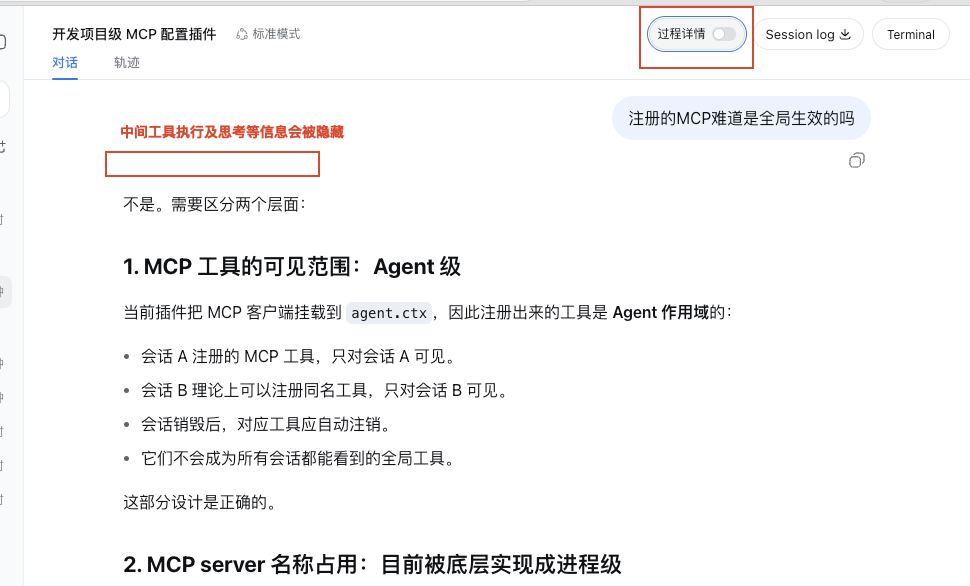

# DeepSeek Harness Monorepo

DeepSeek Harness Web 定制版及相关插件的统一代码仓库。各项目保留原有包管理器、锁文件和独立构建方式。

| 项目 | 路径 | 说明 |
| --- | --- | --- |
| `deepseek-harness-web` | [`packages/deepseek-harness-web`](packages/deepseek-harness-web/README.md) | 支持局域网登录、移动端适配与内置项目级 MCP 的 Web 定制版 |
| `dsh-chat-process-visibility` | [`packages/deepseek-harness-chat-plugin`](packages/deepseek-harness-chat-plugin/README.md) | 按会话控制过程详情显隐 |
| `dsh-web-mermaid` | [`packages/deepseek-harness-mermaid-plugin`](packages/deepseek-harness-mermaid-plugin/README.md) | 在 Web UI 中渲染 Mermaid 代码块 |
| `dsh-web-terminal` | [`packages/deepseek-harness-terminal-plugin`](packages/deepseek-harness-terminal-plugin/README.md) | 在 Web UI 中提供交互式终端 |

## Web 定制版

在官方版本基础上：

- 增加局域网支持，包含登录页面和移动端 UI 适配
- 去除 DeepSeek Web Search
- 去除 OpenAI、Anthropic 以外的供应商支持
- 去除 sandbox，避免模型频繁因 sandbox 报错
- 内置项目级 `.mcp.json` 加载，并携带 Agent 作用域的官方 rc.8 MCP client fork

## 插件预览

### Mermaid


### Terminal


### Chat



## 开发技能

插件开发可使用独立的 [`deepseek-harness-plugin-skill`](skills/deepseek-harness-plugin-skill/README.md)。

进入对应项目目录后，使用该项目 README 中记录的安装、检查和构建命令。Web 项目使用 npm，插件项目使用 pnpm。

## 一键准备与启动

首次拉取仓库或插件依赖变化后，在仓库根目录运行：

```sh
npm run bootstrap
```

该命令会扫描 `packages/` 中声明了 `dsh.bundle` 的插件，分别执行 `pnpm install --frozen-lockfile` 和 `pnpm run build`，然后安装 Web 的生产依赖。它不会向 `$DSH_HOME` 安装插件。

启动方式：

```sh
npm run web      # packages/deepseek-harness-web/start.sh
npm run web_lan  # packages/deepseek-harness-web/start_lan.sh
```

两个启动脚本会自动加载同级 `packages/` 下已构建的插件 bundle；本地插件与 `$DSH_HOME/profiles/web` 中同名的 bundle 同时存在时，优先使用仓库中的本地版本。
