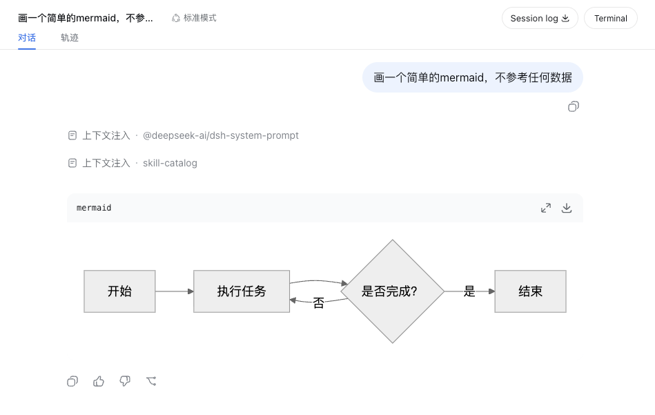

# dsh-web-mermaid

`dsh-web-mermaid` 为 DeepSeek Harness Web UI 渲染 Markdown 中的 Mermaid 围栏，目标版本为 Harness `0.1.0-rc.6`，同时兼容已核对相同代码块 DOM 的 `0.1.0-rc.5`。

````markdown

````

回复流式输出期间仍显示普通代码；围栏定稿后自动替换为带操作栏的 SVG 卡片。卡片提供放大预览和 SVG 下载；放大预览内可通过 `−`／`+` 按 25% 步进在 50%～300% 之间缩放。Mermaid 语法错误时保留原代码块。渲染使用 Mermaid `securityLevel: strict`，不执行围栏中的 HTML 或脚本。

## 安装

```bash
pnpm install
pnpm build

dsh plugin --profile web add .
dsh --profile web --dump-config
dsh web
```

从 Harness 源码仓库运行时，把 `dsh` 改为 `pnpm dsh`。安装后重启 Web UI，并对已打开页面执行硬刷新。

## 实现说明

插件是一个标准 `dsh.client` bundle：Host 侧为空入口，Client 侧通过一个 Cordis effect 管理 Mermaid 初始化、DOM 监听、图表卡片、放大预览、SVG 下载、样式及卸载清理；预览和下载不依赖 Harness 内置 Mermaid 组件。

Harness `0.1.0-rc.5`／`rc.6` 的 `MarkdownText` 尚未提供围栏 renderer slot，因此插件监听其公开的全局代码块类 `.md-code-block`，从语言横幅识别 `mermaid`。Harness 升级后应优先迁移到官方围栏扩展点；若代码块 DOM 约定变化，需要同步调整识别逻辑。

## 效果

