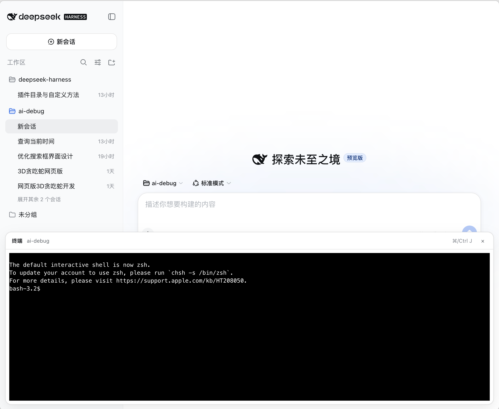
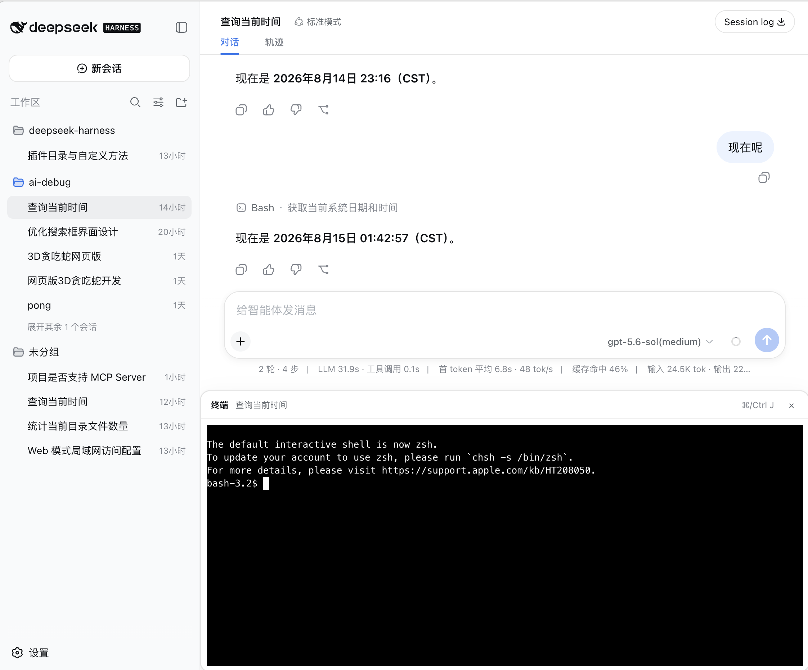
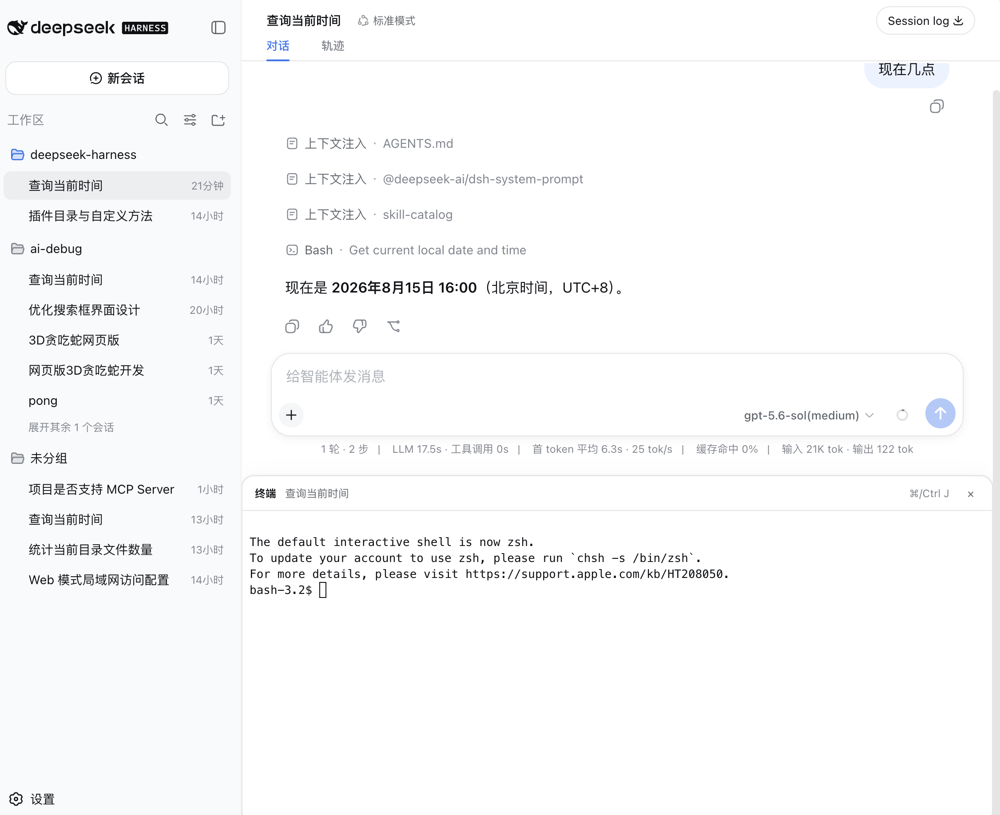

# dsh-web-terminal

`dsh-web-terminal` 是面向 DeepSeek Harness `>=0.1.0-rc.5 <0.2.0` 的 Web 终端插件，为 `dsh-web` 提供跟随当前 Session 工作区的交互式终端。

终端嵌入当前 Session 的中间对话区域，显示在输入框下方并随对话区贴底；打开时参与正常布局，把输入框向上推而不是覆盖页面。终端会跟随网页当前的浅色／深色主题切换背景和前景色。点击会话右上角的“Terminal”按钮，或按 `Cmd+J`（macOS）／`Ctrl+J`（Windows/Linux），即可打开、隐藏并聚焦。插件使用 xterm.js 渲染，通过 Harness 的 subprocess 与 sandbox 扩展点启动 PTY，并在切换 Session、关闭页面或卸载插件时自动清理进程。

当前版本提供单终端和固定初始尺寸；由于 Harness 暂无 PTY resize 接口，窗口尺寸变化后 `vim`、`top` 等全屏程序可能无法完美适配。审批、提问等界面接管输入框期间，终端会随普通输入栏暂时隐藏。

## 怎么使用

### 安装

插件尚未发布到 npm，可从本地目录安装：

```bash
cd <插件目录>
pnpm install
pnpm build

cd <deepseek-harness 目录>
pnpm dsh plugin --profile web add <插件目录>
```

开发依赖直接从 npm 安装，不要求插件目录旁存在 `deepseek-harness` 源码仓库。

安装后需要重启 `dsh-web`：

```bash
pnpm dsh web
```

如果安装时 `dsh-web` 已经运行，请先停止旧进程，重启后再对浏览器执行硬刷新。

### 局域网访问

当 `dsh-web` 绑定到 `0.0.0.0` 时，可以通过服务端的局域网 IP 使用终端。终端 WebSocket 只接受同源且客户端、服务端均为回环、私有网络或 `100.64.0.0/10` 共享地址（如 Tailscale）的连接，不接受公网 IP 或域名，以避免 DNS 重绑定。

终端等同于远程 Shell；请只在可信局域网中开放 `dsh-web`。

### 打开终端

1. 在 `dsh-web` 中创建或选择一个 Session。
2. 点击会话右上角的“Terminal”按钮，或按 `Cmd+J`（macOS）／`Ctrl+J`（Windows/Linux）打开终端。
3. 再次点击“Terminal”按钮、按快捷键或点击面板关闭按钮可隐藏终端；重新打开后终端进程仍然保留。
4. 切换 Session、关闭页面或停止 `dsh-web` 时，对应终端进程会自动结束。

## 怎么开发的

```
user:
/deepseek-harness-plugin-skill
给 dsh-web 开发一个终端, 通过 cmd(ctrl)+j 触发, 可行吗

---

assistant:
可行。Harness 0.1.0-rc.5 已具备所需扩展点，无需修改 agent loop。

最小方案：

Client 插件注册到 shell.overlay，显示底部抽屉。
捕获 Cmd+J / Ctrl+J，切换终端并聚焦。
用 xterm.js 渲染。
Host 插件通过 ctx.subprocess.spawnTerminal() 启动当前 Session 工作目录下的 PTY。
输入、输出通过现有 Remote API 长轮询传输，复用 /api 的安全与 Agent 身份校验。
插件卸载、Session 结束或页面关闭时终止 PTY。
注意：现有 ctx.terminals 面向模型、偏逐行交互，不适合直接做完整终端；原始 PTY API 当前也没有 resize。因此首版建议固定终端尺寸，支持 shell/REPL，但暂不承诺 vim/top 的完美自适应。

建议先做这个 MVP：单终端、当前工作区、Cmd/Ctrl+J、固定尺寸、自动清理。多标签和动态 resize 后续再加。

---

user:
实现
```



```
user:
终端目前的这个样式可以改改吗？我想的是只在对话框那边显示，并且它打开的时候始终在聊天框下面 (打开的时候把聊天框往上顶)

先告诉我，可不可以实现？实现起来麻不麻烦？是否需要用很特殊的手段，还是官方就已经提供

---

assistant:
可以实现，难度不大。

目前终端注册在官方的 shell.overlay，所以会覆盖整个页面。可以改为注册到官方的 conversation.composer.dock：

终端只显示在中间对话区域，不覆盖侧边栏。
位于输入框下方。
使用正常布局，打开后终端增加高度，输入框自然向上移动。
不需要 Portal、DOM 查询、MutationObserver 或修改 Host/PTY 协议。
主要调整 Client 注册位置、组件样式，并在显示后重新执行一次 xterm fit()。
需要注意：这个官方 slot 原本主要用于输入框下方的状态信息，并非专门为大型交互面板设计，但技术上可以正常承载终端。若要求在审批/提问等“输入框接管”状态下也始终显示，则 rc.5 没有完全匹配的官方 slot，最好给 Harness 补一个专用位置，而不是写 CSS 黑魔法。

---

user:
做一版我看看

assistant:
(doing...)

---

user:
按快捷键后终端没有出来

---

assistant:
已修复。根因是原 slot 在空白新会话中不渲染。
```



```
user:
能够识别网页的主题是浅色还是暗色，从而修改终端的背景颜色吗, 如果网页是浅色，终
端就是白色背景, 以此类推

---

assistant:
(doing...)
```


