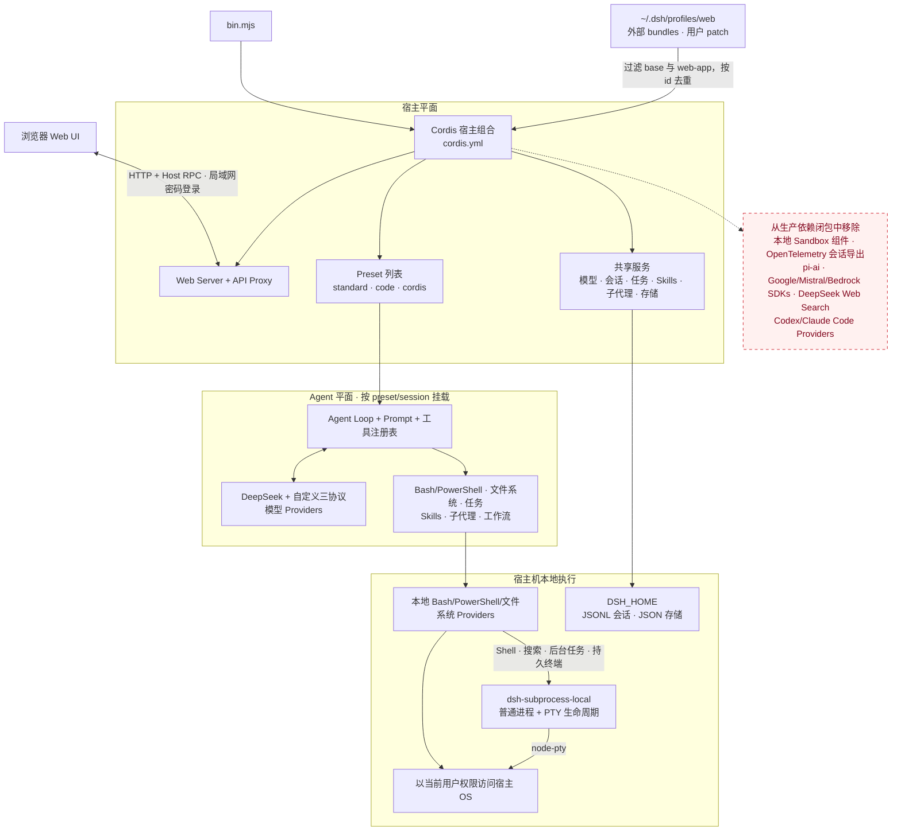
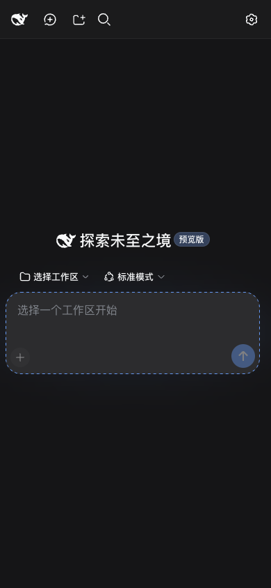
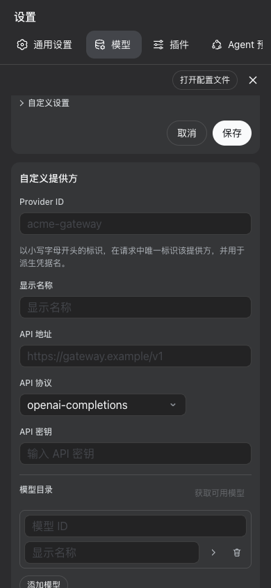

# deepseek-harness-web

一个独立的 DeepSeek Harness Web 发行版，直接在宿主机上执行命令。父仓库中的既有文件保持不变。

## 包含的功能

该发行版保留模型选择、通用/模型/插件设置、会话、会话搜索与导出、反馈、目标、计划、任务、Skills、子代理、工作流、轨迹、Code Mode、Cordis Mode，以及 `standard`、`code`、`minimal` 和 `cordis` Agent presets。`minimal`（极简模式）只提供持久 Bash 与 `str_replace_editor`。

该发行版不包含面向模型的 Web 搜索／抓取工具和 OpenTelemetry 会话导出。不需要共享插件时可以使用独立的 `DSH_HOME`。既有 `llm-pi-ai` profiles 不再继承 pi-ai catalogs：每条路由都必须显式提供一个受支持的 `api`、`baseURL` 和非空 `models` 列表。

## 架构实现与裁剪内容



`bin.mjs` 加载分层环境变量，以 `cordis.yml` 为固定基础组合，并读取已有的 `$DSH_HOME/profiles/web`。其中 `@deepseek-ai/dsh-base` 与 `@deepseek-ai/dsh-web-app` 两层会被忽略，其余外部 bundles 依次覆盖基础组合；profile 自己的 `cordis.patch.yml` 最后应用。重复 `insert` 按 `id` 去重：同名插件转换为覆盖，插件名冲突则启动失败。外部包通过 profile 的 `node_modules` 解析，不会把官方基础 bundle 重新带回。配置在进程启动时读取，修改后需要重启。

启动器默认以 `NODE_USE_ENV_PROXY=1` 重新启动实际服务进程，因此 DeepSeek、自定义 Provider 和模型发现使用的 Node `fetch` 会自动遵循启动环境中的 `HTTP_PROXY`、`HTTPS_PROXY` 与 `NO_PROXY`。显式设置 `NODE_USE_ENV_PROXY=0` 可以关闭该行为。

宿主平面负责 Web/RPC 接口和共享注册表；内置 presets 添加面向各会话的工具与行为。工具直接使用本地 Bash/PowerShell/文件系统 providers；Shell 执行、文件系统搜索、后台任务和持久终端共用官方 `dsh-subprocess-local`，由它负责普通进程与 PTY 的清理、取消、进程树和有界输出生命周期。

`llm-custom-providers.mjs` 替换了 pi-ai adapter，同时保留 `llm-pi-ai` settings namespace 和 Web 自定义 Provider 表单。它只注册用户声明的路由，并通过 OpenAI 或 Anthropic SDK 分派请求；发行包不再内置任何官方 Provider 或模型 catalog。

本地 Sandbox provider 仍未恢复：命令和终端直接在宿主机上执行。官方 `dsh-subprocess-local` 提供普通子进程和 `node-pty` 终端；`dsh-terminal`、`dsh-terminal-bash` 与 `dsh-tool-bash-persistent` 为 `minimal` preset 提供按 Agent 隔离的持久 Bash。其余被裁剪组件和 providers 均不提供回退。

## 自定义模型 Providers

Models 页面可以新增任意 Provider 路由，协议限于 `openai-completions`、`openai-responses` 和 `anthropic-messages`。默认只有回环地址可以访问该页面；以 `--allow-remote-settings` 启动后，可信局域网客户端也可以使用。每条路由必须声明 Provider ID、显示名称、API 协议、base URL 和至少一个模型。API key 通过现有只写 credentials 服务保存；也支持无需密钥的自定义端点。发行包不预设官方 Provider，也不继承模型 catalog。一个未激活的 `custom-provider` 模板只用于让 Web 表单能够访问自定义 Provider namespace；除非用户配置它，否则不会注册任何模型路由。

等价的 settings 格式如下：

```yaml
llm-pi-ai:
  providers:
    company-gateway:
      displayName: Company Gateway
      api: openai-responses
      baseURL: https://gateway.example.com/v1
      apiKeyEnv: COMPANY_GATEWAY_API_KEY
      models:
        - id: company-large
          name: Company Large
          contextWindow: 262144
          maxTokens: 32768
```

模型能力字段均为可选；尤其是省略的、或经 schema 归一化后为空的 `reasoningEfforts`，表示未声明任何推理强度。

两个 OpenAI 协议都把 `baseURL` 作为 API 前缀，并在其后追加 `/chat/completions`、`/responses` 或 `/models`。Anthropic SDK 会追加 `/v1/messages`；该协议没有通用模型列表端点，因此模型必须手工填写。既有会话仍可读取；替换 adapter 会忽略 pi-ai 私有 replay metadata。

## 本地执行

Bash、PowerShell、文件系统和子进程操作直接在宿主机上运行。子进程 provider 支持普通前台与后台进程、带私有溢出文件的有界输出收集、取消与超时信号、进程树终止，以及等待所有进程退出后再完成卸载；PTY 会话额外支持终端文本传输、前台进程组信号和完整终端树清理。`minimal` preset 的 Bash 状态会在同一 Agent 的多次工具调用间保留，但不会跨 Harness 进程重启恢复。

该发行版不包含 sandbox providers。审批策略固定为 `never`，保留的策略元数据为 `danger-full-access`。子进程继承的环境会移除疑似凭据的变量，但命令仍拥有当前用户的宿主机权限。请只运行可信任务，并将服务器绑定到可信网络接口。Web 载体要求浏览器请求同源并拒绝 cross-site 请求；非回环地址访问还需要单用户密码登录，回环地址访问保持免登录。

## 移动端支持

手机窄屏（宽度不超过 720px）会把收起后的侧栏控制栏移到会话顶部；展开侧栏时改为占满页面，而不再挤压会话区域，从列表选择会话后会自动收起。会话消息、输入框和工具栏使用更紧凑的间距，设置页改为全屏纵向布局，其分区导航可以横向滚动。触屏设备的低高度横屏也会使用同一布局。

<p align="center">
  
  
</p>

这是面向聊天与常用设置的基础适配，不是对所有详情面板、轨迹表格和第三方客户端插件的完整移动端重设计。移动端仍应通过受保护的局域网或 TLS 入口访问。

## 安装和运行

可以使用封装好的脚本：
- `start.sh`：本地回环地址
- `start_lan.sh`：局域网可访问

如果 `$DSH_HOME/profiles/web/package.json` 已存在，通过 `dsh plugin --profile web` 安装的外部 bundle 会在重启后同时应用到本发行版。该 profile 及其依赖属于可信宿主代码。当前 profile 已安装 `dsh-chat-process-visibility`：会话右上角的“过程详情”开关可持久化隐藏或显示工具调用、思考、上下文注入、压缩／重试与工作流运行等 Chat 内部过程节点，普通正文、状态、错误和独立“轨迹”视图不受影响。Web 终端插件现在可以通过已恢复的 PTY subprocess provider 创建终端。

项目根目录的 `dsh-lan.pm2.config.cjs` 提供等价的 PM2 配置，固定监听 `0.0.0.0:3081` 并开启远程设置：

```sh
pm2 start dsh-lan.pm2.config.cjs
pm2 save
```

也可以使用以下方式

```sh
cd deepseek-harness-web
npm install --omit=dev
DSH_HOME=/tmp/deepseek-harness-web-home DEEPSEEK_API_KEY=... npm start
```

默认仍仅监听回环地址：

```sh
npm start -- --host 127.0.0.1 --port 3081
```

要向可信局域网提供服务，可监听所有接口：

```sh
npm start -- --host 0.0.0.0 --port 3081
```

如果启动异常, 尝试重新安装依赖

```sh
npm ci \
  --registry=https://registry.npmjs.org \
  --omit=dev \
  --include=optional \
  --foreground-scripts
```

首次启动后，先在服务器本机打开 `http://127.0.0.1:3081`，进入“设置 → 通用设置”，配置至少 8 位的“局域网登录密码”。回环地址始终免登录；通过局域网 IP 或域名访问时只显示密码输入框。未配置密码时，局域网访问会被拒绝，并提示回到本机完成配置。

密码通过现有 credentials provider 以 `DSH_LAN_PASSWORD` 保存到 owner-only 的 `$DSH_HOME/.credentials.yaml`，不会通过读取接口返回；也可以在启动环境中设置同名变量，此时设置页面只显示已配置状态而不能覆盖它。登录成功后会签发 7 天有效的 HttpOnly、SameSite=Strict 进程内会话；修改密码或重启服务会使已有会话失效。

局域网 IPv4 字面地址，以及已经解析或反向代理到该服务的任意格式合法域名，都可以直接访问，不再要求预先配置域名白名单；所有非回环 authority 都会进入同一个密码登录流程。`--trusted-host` 仅为已有启动脚本保留，已不再是域名访问的必要参数。认证后的 Web 终端连接会保留浏览器的原始 authority，因此通过 Tailscale `100.64.0.0/10` 地址访问也不需要额外声明 trusted host。Host 与 Origin 仍必须同源，`Sec-Fetch-Site: cross-site` 仍会被拒绝。

对于普通 HTTP 局域网来源，如果浏览器没有提供 `crypto.randomUUID()`，启动前兼容层会用 `crypto.getRandomValues()` 补充它，使应用内目录浏览器等 Host RPC 可以工作，而不会退化到 `Math.random()`；HTTPS 仍使用浏览器原生实现。

Settings 与 credentials 默认仍限回环访问；可为可信局域网显式开启：

```sh
npm start -- --host 0.0.0.0 --port 3081 \
  --allow-remote-settings
```

该参数允许已通过密码登录的同源局域网客户端读取／写入已公开的 settings 与 credentials，并执行自定义模型发现；它不会开放原生路径操作或 preset 创作 RPC，使用域名时也无需额外参数。

局域网登录会保护静态页面、HTTP RPC 和 WebSocket，但普通 HTTP 仍会明文传输密码、会话 Cookie 与业务数据，也不提供公网级传输安全。不要把服务端口直接暴露到公网；Internet 场景仍应增加 TLS、前置访问控制与防火墙，阻止客户端绕过安全入口直连服务。

Harness packages 固定使用 npm 已发布的 `0.1.0-rc.6`。升级时应同时刷新提取的 composition 和 presets。

### 跨服务器部署注意事项

不要把一台机器已经生成的 `node_modules` 直接复制到另一台不同操作系统、CPU 架构或 libc 的服务器。该发行版包含 `node-pty`、Sharp/Koffi 等原生或平台相关依赖；应在目标服务器的项目目录中使用受支持的 Node.js（`^22.21.0` 或 `>=24.0.0`）重新执行 `npm ci --omit=dev`。若从压缩包部署，建议只传源码、`package.json` 和 `package-lock.json`，不要包含 `node_modules`。

启动失败时，启动器会展开 Cordis `AggregateError` 的每个成员及其 cause。除了最外层的 `loader entries failed to apply`，日志还会明确显示失败的 entry 名称和底层错误。常见处理顺序：

```sh
node --version
npm --version
rm -rf node_modules
npm ci --omit=dev
npm ls --omit=dev --depth=0
npm start
```

如仍失败，请保留展开后的完整输出；重点查看 `failed to apply loader entry <id> (<package>)` 后面的 `Cannot find module`、原生 `.node` 文件、权限、配置文件或外部 profile bundle 错误。

## 参考体积

在 macOS arm64 上，全新 npm 生产安装占用 195.3 MiB，压缩后为 45.4 MiB；其中 `node-pty` 的多平台 prebuilds 占约 58 MiB。同一宿主机上的完整 `@deepseek-ai/dsh@0.1.0-rc.6` 安装占用 343 MiB，压缩后为 63 MiB。

生产依赖闭包不包含本地 sandbox 组件、OpenTelemetry 会话导出、pi-ai、Google、Mistral、Bedrock、DeepSeek Web Search、Codex 和 Claude Code providers。PTY 与极简模式需要 `dsh-subprocess-local`、终端 packages 和 `node-pty`。三个自定义 wire protocols 仍使用 OpenAI 与 Anthropic SDK；完整 Web 与工具 packages 还需要语法高亮、图像库、sandbox 类型和 sandbox policy 元数据。
